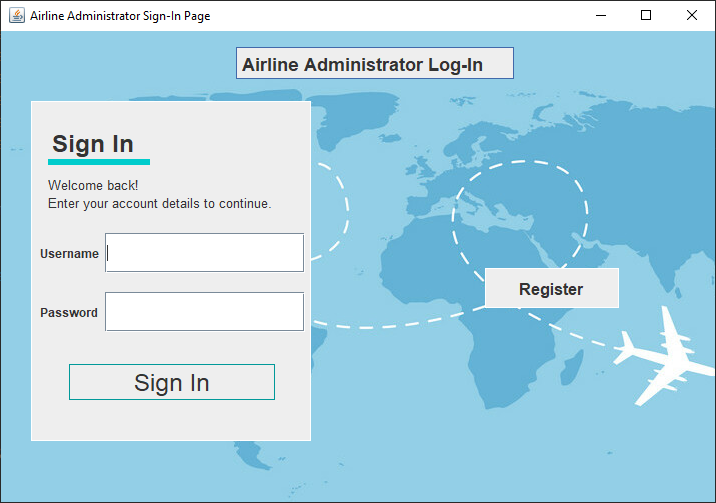
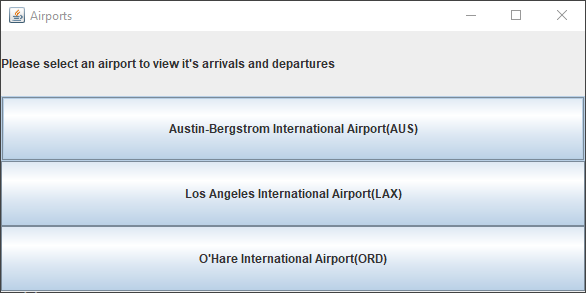
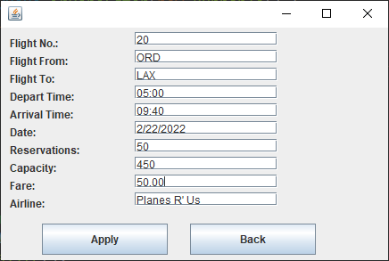
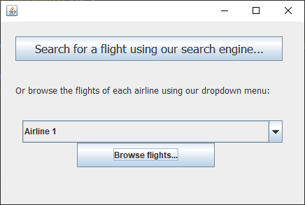
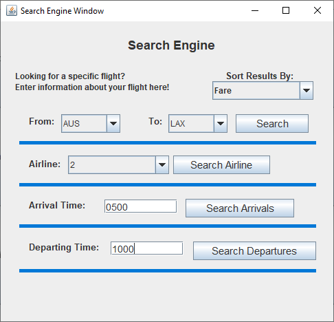
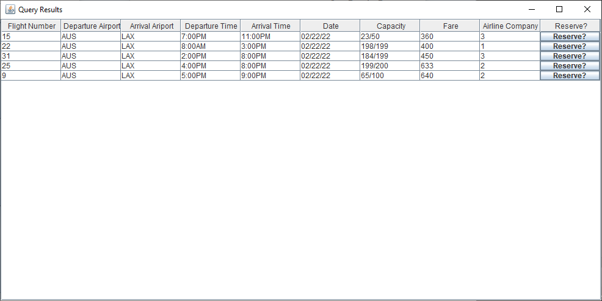
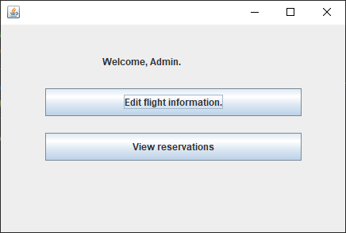
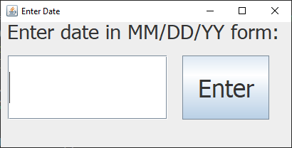

# Airline System

A collaborative effort to create a Airline System CRUD application in Java

## Description
### Goal
The goal of this project was to develop a CRUD application with a team that simulates a online reservation system for airlines and to  satisfy various project requirements. This program must not only create, read, update and delete data but must also satisfy the following requirements and entities:
### GUI and Data Storage
The CRUD program must have
- A GUI
- Persistence across invocations
#### A GUI
For this program, we decided to use Java Swing to create this project into a window-based application.
#### Persistence Across Invocations
Persistence across invocations means that all data must be saved in such a way that the program can be turned off, and when turned back on all data is still present. In order to accomplish this we used a file system to save all relevant data.
### Customer
- A customer can make reservations for flights.
    1. A customer can go to a search engine to look up available airlines and flights and fares.
    2. Alternatively, a customer can go directly to the GUI of an airline and make a reservation there.
    3. A customer can also cancel a reservation
- A customer must have a password protected account.
    1. A customer can pull up a read only GUI to display all his/her reservations.
    2. A customer is not allowed to see the data for other customers.
### Airline

- An airline must have a GUI which displays all its flights and fares.
    1. An airline administrator can insert additional flights/fares and/or cancel flights.
    2. Customers can only read the flight/fares information but cannot edit it.

- Customers can make reservations (and cancel) using an airline's GUI.
- Each flight has a max capacity (set by the airline administrator).
    1. If a flight is full, customers cannot make reservations for that flight.
- An airline must have a read only GUI which displays all the reservations made by all the customers.
    1. This GUI can be read only by and airline administrators, not by customers.
- If a flight is cancelled, the accounts of all customers with bookings on that flight must be updated to indicate their reservation was cancelled.

### Airport
- An airport must have a "arrivals information screen: which displays all the arriving flights and times by all the airlines operating at that airport.
    1. The GUI is public and read only
    2. If an airline cancels a flight, a "cancelled" flight status must be displayed for that flight.
    3. Else display "on time" as the flight status.
    4. Therefor the GUI should have a timer to access information from the airline to check if the flight is cancelled, and the display should be updates to display changes.
- There is no "airport administrator" in the sense that all the GUIs for an airport are public (no password required) and read-only
### Search Engine

- Customers can go to a "search engine" to look up information for flights and fares.
- Customers input selection criteria and the search engine displays the results of the query.
- Customers can sort the display by fares or airline names.
- If a flight is full the display must say so.
- Customers can make flight reservations using the search engine.

- The search engine administrator can view all the reservations made by all the customers using the search engine.
    1. This GUI can be read only by the search enginer administrator, not by customers and not by the airlines.
    2. The search engine administrator can only view reservations made using the search engine.
    3. The search engine administrator cannot view reservations that customers made using the airline's GUI

### Current Date

- When the program is started, a GUI should pop up asking to enter the input date
- The current date is a global variable available to all parts of the program.
- The value of the current date is set in the initial GUI and is a read-only variable in the rest of the program
- The value of the current date should be displayed in all relevant GUIs in the program
- In particular, the airport arrival and departure screens display flight information only for the current date.
### Notes